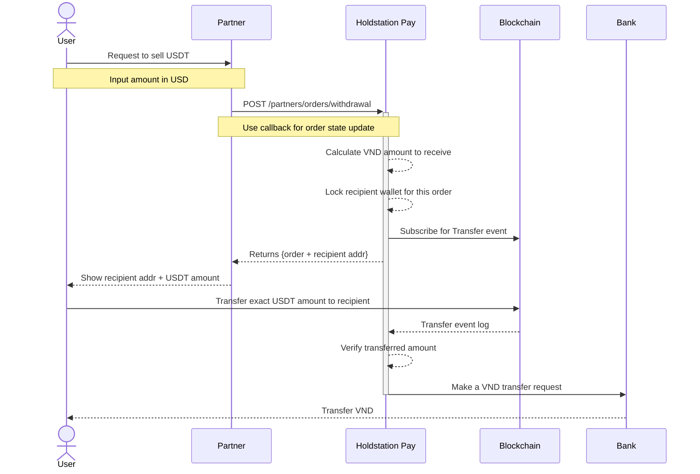
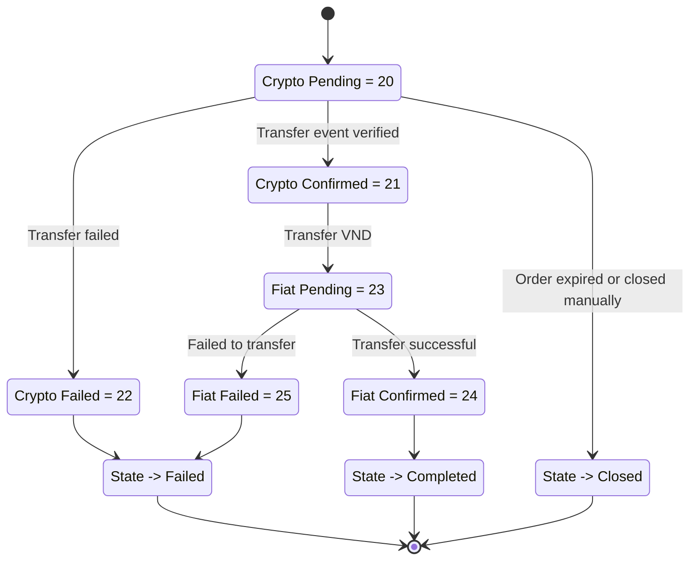

## Overview

The offramp flow allows users to **sell USDT and receive VND**. The partner creates a withdrawal order, shows the recipient address to the user, and the user transfers USDT on-chain. Holdstation Pay then sends VND to the user's bank account.

## Sequence Diagram

## Processing States Flow

## Step-by-Step

<Steps>
  <Step title="Create a withdrawal order">
    Call `POST /partners/orders/withdrawal` with the amount, currency, payment info (bank details), token address, chain ID, and callback URL.
  </Step>
  <Step title="Present recipient address">
    Display the `recipient` wallet address and exact USDT amount from the response to the user.
  </Step>
  <Step title="User transfers USDT">
    The user sends the exact USDT amount to the recipient address on the specified blockchain.
  </Step>
  <Step title="Holdstation verifies transfer">
    Holdstation Pay detects and verifies the on-chain transfer event.
  </Step>
  <Step title="VND sent to bank">
    Once verified, Holdstation Pay initiates the VND bank transfer to the user's account. The order moves to **Completed**.
  </Step>
</Steps>
