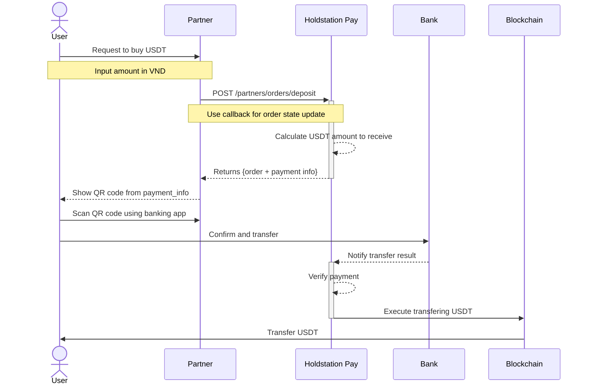
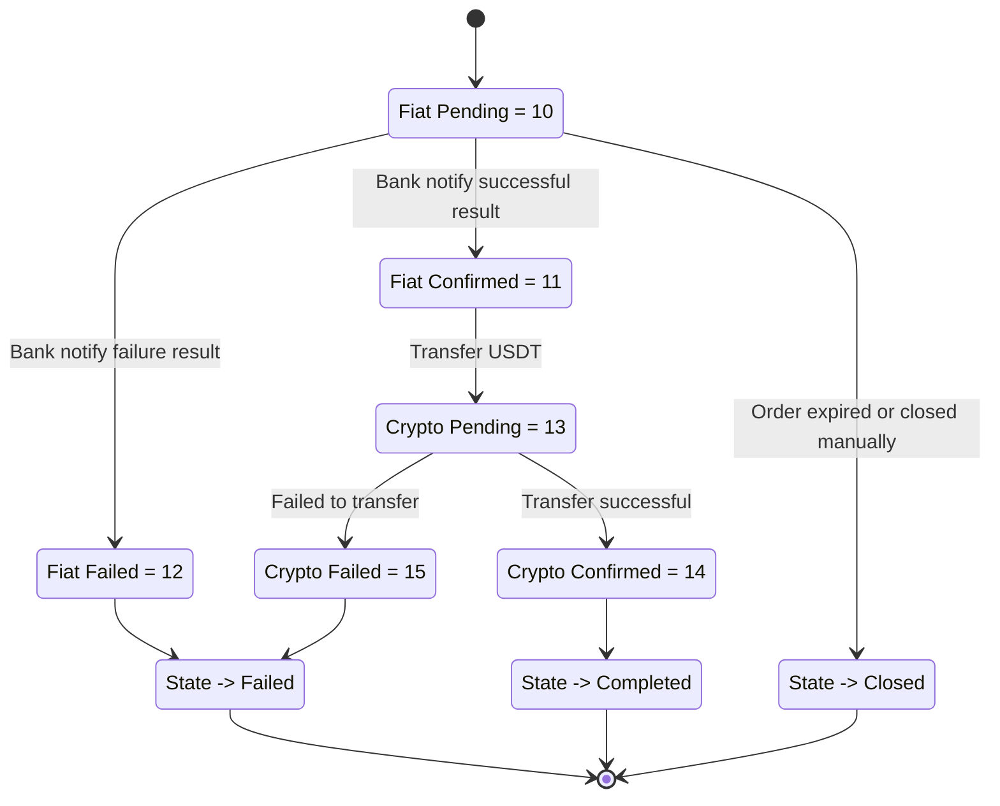

## Overview

The onramp flow allows users to **buy USDT using VND**. The partner creates a deposit order via the API, presents a QR code to the user, and the user pays through their banking app.

## Sequence Diagram

## Processing States Flow

## Step-by-Step

<Steps>
  <Step title="Create a deposit order">
    Call `POST /partners/orders/deposit` with the amount in VND, recipient wallet address, token address, chain ID, and callback URL.
  </Step>
  <Step title="Present payment to user">
    Use the `pay_data` from the response to display a QR code to the user. The QR code contains bank transfer details.
  </Step>
  <Step title="User completes payment">
    The user scans the QR code with their banking app and confirms the VND transfer.
  </Step>
  <Step title="Receive webhook updates">
    Holdstation Pay verifies the fiat payment and initiates the on-chain USDT transfer. Your callback URL receives status updates throughout the process.
  </Step>
  <Step title="USDT delivered">
    Once the blockchain transfer is confirmed, the order state moves to **Completed** and the user receives USDT in their wallet.
  </Step>
</Steps>
