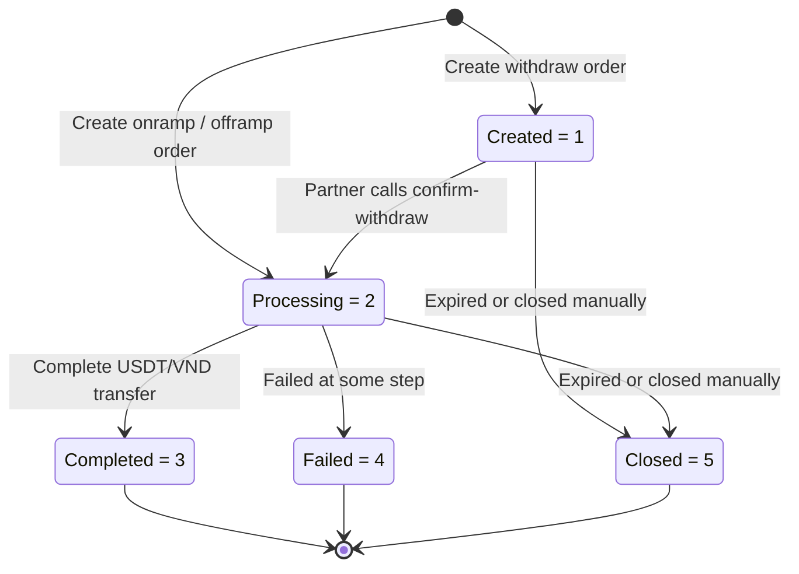

## Order States

Holdstation Pay uses specific order states and processing states to track the status of each order. When creating an order, you can use the `callback` parameter to receive real-time updates about order status changes via [webhooks](/guides/webhooks).

| State          | Value | Description                                                                                          |
|----------------|-------|------------------------------------------------------------------------------------------------------|
| **Created**    | 1     | Order has been created but not yet processed. Withdraw orders start here pending partner confirmation.|
| **Processing** | 2     | Order is being processed                                                                             |
| **Completed**  | 3     | Order has been completed successfully                                                                |
| **Failed**     | 4     | Order has failed                                                                                     |
| **Closed**     | 5     | Order has been closed                                                                                |

## Processing States

When the order state is `Processing`, it will have more detailed processing states depending on order type.

### Deposit Orders (Onramp)

| Processing State    | Value | Description                          |
|---------------------|-------|--------------------------------------|
| Fiat Pending        | 10    | Waiting for user to deposit fiat     |
| Fiat Confirmed      | 11    | Fiat deposit confirmed               |
| Fiat Failed         | 12    | Fiat failed to deposit               |
| Crypto Pending      | 13    | Waiting for USDT transfer on-chain   |
| Crypto Confirmed    | 14    | USDT transfer confirmed              |
| Crypto Failed       | 15    | USDT failed to transfer              |

### Withdrawal Orders (Offramp)

| Processing State    | Value | Description                          |
|---------------------|-------|--------------------------------------|
| Crypto Pending      | 20    | Waiting for user to transfer USDT    |
| Crypto Confirmed    | 21    | USDT transfer confirmed              |
| Crypto Failed       | 22    | USDT failed to transfer              |
| Fiat Pending        | 23    | Waiting for VND transfer             |
| Fiat Confirmed      | 24    | VND transfer confirmed               |
| Fiat Failed         | 25    | VND failed to transfer               |

### Withdraw Orders (Prefunded Disbursement)

For two-step withdraw orders created via [Offramp from Prefunding](/guides/partner-prefunding), the order moves through a dedicated processing-state set after the partner calls confirm-withdraw.

| Processing State    | Value | Description                                            |
|---------------------|-------|--------------------------------------------------------|
| Fiat Queued         | 31    | Confirmed by partner; queued for VND disbursement      |
| Fiat Processing     | 32    | Payment gateway is processing the VND transfer         |
| Fiat Confirmed      | 33    | VND successfully sent to the recipient                 |
| Fiat Failed         | 34    | VND transfer failed                                    |
