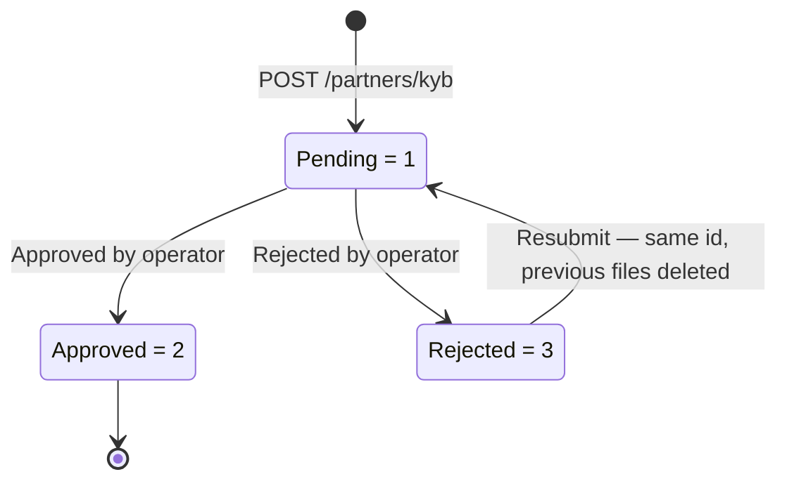

Partner Business KYB is how you submit the legal identity of a business to Holdstation Pay for verification — the registered company details, its legal representative and directors, and the supporting documents for each.

A KYB record covers either **your own partner entity** or **a merchant operating under you**, selected with `subject_type`.

<Note>
  KYB endpoints use the same Ed25519 signed-API scheme as the MID and KYC endpoints. See [Request Signing](/guides/partner-authentication-signed-api/overview).
</Note>

## Subject Type

| Value | Subject | Scoped by |
|---|---|---|
| `1` | Partner (self) | The partner account — one record only |
| `2` | Sub-merchant | `reference_id` — one record per merchant |

For `subject_type = 1`, a partner holds at most one KYB record and `reference_id` is not used.

For `subject_type = 2`, the same rule applies **per `reference_id`** — your own id for that merchant. Send your merchant id as `reference_id`, or omit it and Holdstation Pay generates one and returns it. A partner can therefore hold one live record per merchant beneath it.

## One Live Record Per Subject

The record id is generated by Holdstation Pay and returned as `id` on submission — never send one yourself. There is **no update endpoint**.

- While a record is **Pending** or **Approved**, another `POST` for the same subject fails with `409 Conflict`.
- Once a record is **Rejected**, `POST` again to replace it. The new submission resets the status to **Pending**, the record **keeps its original id**, and the files attached to the rejected submission are deleted.

<Tip>
  Use [List KYB](/api-reference/kyb/list-kyb) with `reference_id` to check whether a merchant has already been filed and to recover its `id`.
</Tip>

## Status Lifecycle

| Status | Value | Description |
|---|---|---|
| **Pending** | `1` | Submitted; awaiting operator review. `reviewed_at` is `null`. |
| **Approved** | `2` | Approved by an operator |
| **Rejected** | `3` | Rejected by an operator; `rejection_reason` explains why |

`rejection_reason` is set when the status is `3` and is an empty string otherwise.

## Endpoints

| Method | Path | Description |
|---|---|---|
| `POST` | `/partners/kyb` | [Submit KYB record](/api-reference/kyb/submit-kyb). Returns `201 Created`; fails with `409 Conflict` if a Pending or Approved record already exists for the subject. |
| `GET` | `/partners/kyb` | [List KYB records](/api-reference/kyb/list-kyb), newest first, filterable by `reference_id`, `subject_type`, and `status`. |
| `GET` | `/partners/kyb/{id}` | [Get KYB record](/api-reference/kyb/get-kyb), including current status and rejection reason. |

<Note>
  There is no update endpoint and no delete endpoint. To change a record, wait for it to be rejected and submit again.
</Note>

## Next Steps

<CardGroup cols={3}>
  <Card title="Field Reference" icon="table-list" href="/guides/partner-business-kyb/field-reference">
    Every business, person, document, and file field.
  </Card>
  <Card title="Submission Rules" icon="list-check" href="/guides/partner-business-kyb/submission-rules">
    The checks a submission must pass before it is accepted.
  </Card>
  <Card title="Submitting Documents" icon="file-arrow-up" href="/guides/partner-business-kyb/submitting-documents">
    File encoding, limits, and error codes.
  </Card>
</CardGroup>
