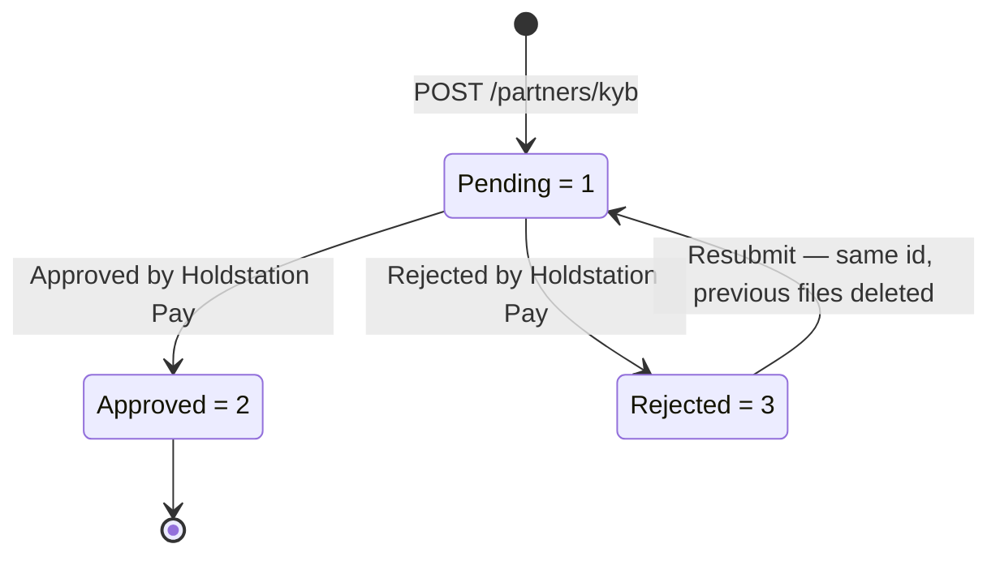

Partner Business KYB is how you submit the legal identity of a business to Holdstation Pay for verification — the registered company details, its legal representatives and directors, and the supporting documents for each.

A KYB record covers either **your own partner entity** or **a merchant operating under you**, selected with `subject_type`.

<Note>
  KYB endpoints use the same Ed25519 signed-API scheme as the MID and KYC endpoints. See [Request Signing](/guides/partner-authentication-signed-api/overview).
</Note>

## Subject Type

| Value | Subject | Description |
|---|---|---|
| `1` | The partner itself | The business that holds the partner account |
| `2` | A merchant under the partner | A business the partner onboards and operates on behalf of |

## One Record Per Partner

A partner holds **at most one** KYB record at a time. The record id is generated by Holdstation Pay and returned as `id` on submission — never send one yourself.

- While the record is **Pending** or **Approved**, another `POST /partners/kyb` fails with `409 Conflict`.
- Once the record is **Rejected**, `POST /partners/kyb` again to replace it. The record **keeps its original id**, and the files attached to the rejected submission are deleted.

## Status Lifecycle

| Status | Value | Description |
|---|---|---|
| **Pending** | `1` | Submitted; awaiting review by Holdstation Pay |
| **Approved** | `2` | Verified and accepted |
| **Rejected** | `3` | Rejected after review; `rejection_reason` explains why |

`reviewed_at` is `null` while the record is Pending, and `rejection_reason` is set only when the status is `3`.

## Endpoints

| Method | Path | Description |
|---|---|---|
| `POST` | `/partners/kyb` | [Submit KYB record](/api-reference/kyb/submit-kyb). Fails with `409 Conflict` if a Pending or Approved record already exists. |
| `GET` | `/partners/kyb/{id}` | [Get KYB record](/api-reference/kyb/get-kyb), including current status and rejection reason. |

<Note>
  There is no list endpoint and no delete endpoint. Keep the `id` returned at submission — it is the only way to read the record back.
</Note>

## Next Steps

<CardGroup cols={2}>
  <Card title="Field Reference" icon="table-list" href="/guides/partner-business-kyb/field-reference">
    Every business, person, and document field, with its enum values.
  </Card>
  <Card title="Submitting Documents" icon="file-arrow-up" href="/guides/partner-business-kyb/submitting-documents">
    File encoding, accepted formats, size limits, and validation errors.
  </Card>
</CardGroup>
