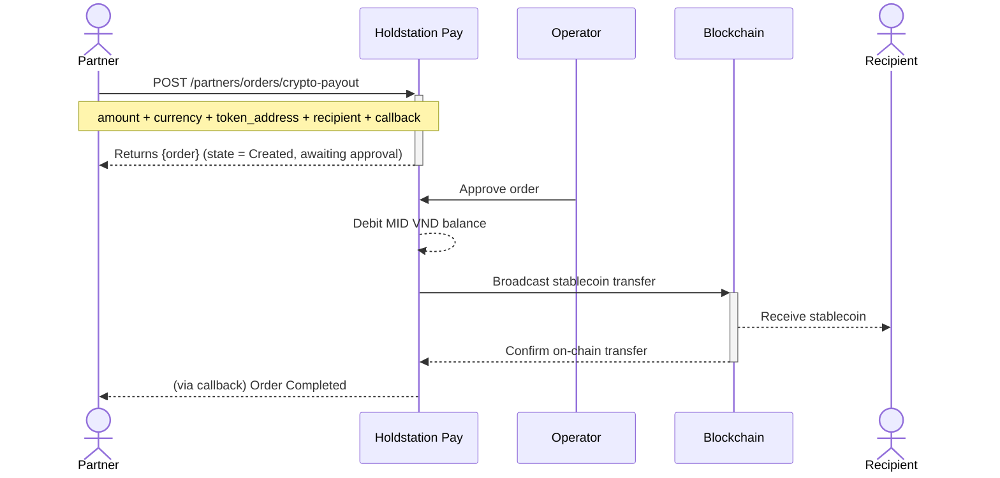

The Crypto Payout endpoint lets a partner spend the VND balance accumulated on their merchant (MID) account to send a stablecoin (e.g. USDT, USDC) to any recipient wallet.

Orders are created in a pending state awaiting Holdstation Pay operator approval — **no VND is debited at create time**. Once approved, Holdstation Pay debits the VND from your MID balance and broadcasts the on-chain stablecoin transfer to the recipient.

<Note>
  The target `token_address` must reference a stablecoin (token with `token_type=STABLECOIN`). Use the [List Tokens](/api-reference/tokens/list-tokens) endpoint to discover supported stablecoins per chain.
</Note>

## Workflow

1. **Check VND balance** — confirm the MID has enough VND via [Get MID Balance](/api-reference/mid/get-balance).
2. **Pick the destination** — choose the target chain and stablecoin contract.
3. **Create the payout order** — call [Create Crypto Payout](/api-reference/mid/crypto-payout) with the spend amount (in VND or token), the recipient wallet address, and a `callback` URL. Use a unique `idempotency_key` for every distinct payout to avoid duplicates.
4. **Wait for operator approval** — the order starts in a pending state. Holdstation Pay operators review and approve.
5. **Receive status webhooks** — the configured `callback` receives [Orders Webhook](/guides/webhooks/orders-webhook) events as the order moves through approval, on-chain submission, confirmation, or failure.

## Currency Modes

The `currency` field controls how `amount` is interpreted:

| `currency` | Meaning                                                                                          |
|------------|--------------------------------------------------------------------------------------------------|
| `vnd`      | Spend exactly this many VND from the MID balance. The amount of stablecoin sent is derived from the live rate. Default. |
| `token`    | Send exactly this many tokens to the recipient. The VND debit is derived from the live rate.     |

## Idempotency

Always send a unique `idempotency_key` for each distinct payout. You can pass it either in the request body or via the `X-Idempotency-Key` header. Replaying the same key returns the original order instead of creating a new one.

## Authentication

All requests require Ed25519 request signing. See [Request Signing](/guides/partner-authentication-signed-api/overview).
