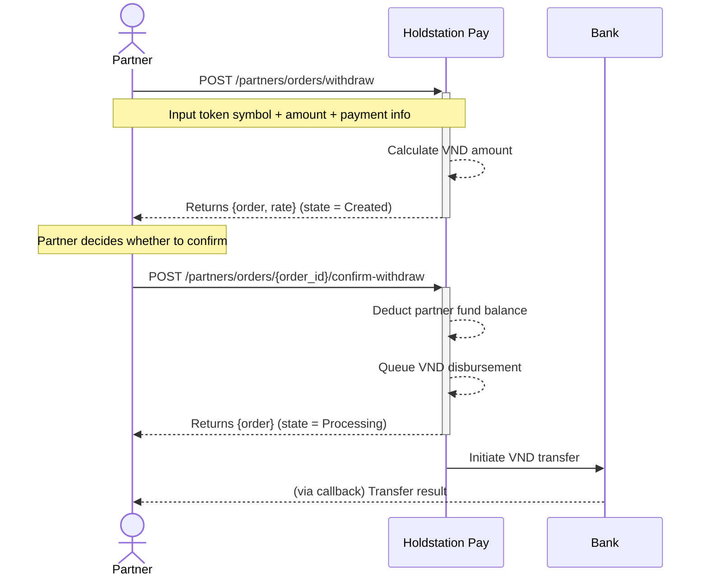
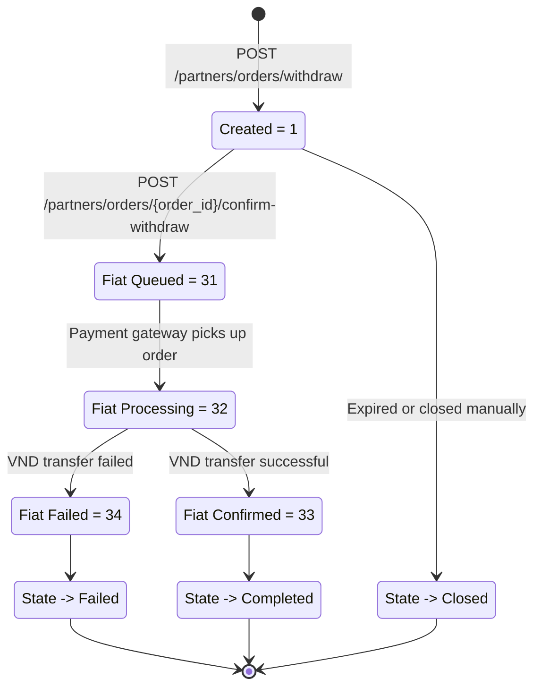

Prefund a stablecoin balance with Holdstation Pay and create offramp orders instantly — no need to wait for on-chain confirmation on every order.

You top up your balance with on-chain deposits once, then debit it directly whenever you create an offramp order, and Holdstation Pay pays out VND to the recipient's bank account.

<Note>
  Contact the Holdstation team to enable this feature for your account.
</Note>

<Note>
  All prefunding endpoints require signed authentication. See [Request Signing](/guides/partner-authentication-signed-api/overview) for how to sign requests.
</Note>

## Workflow

1. **Get deposit addresses** — call [List Deposit Addresses](/api-reference/funds/list-deposit-addresses) to retrieve the on-chain addresses assigned to you on each supported chain.
2. **Deposit on-chain** — send supported tokens (e.g., USDT, USDC) to one of those addresses. Holdstation Pay credits the received amount to your balance once the deposit is detected.
3. **Check balance** — use [List Funds](/api-reference/funds/list-funds) to view all balances, or [Get Fund Balance](/api-reference/funds/get-balance) for a single token.
4. **Create offramp order** — call [Create Withdrawal from Fund](/api-reference/funds/withdraw) to create an order with a confirmed quote (rate, outcome, fees). No VND is sent yet — the order is held for up to **15 minutes** awaiting confirmation. Always include an `idempotency_key` to avoid duplicate orders.
5. **Confirm disbursement** — call [Confirm Withdrawal](/api-reference/funds/confirm-withdraw) with the `order_id` from step 4 to release the payout. Holdstation Pay debits your balance and sends VND to the recipient bank account using the details on the order. If not confirmed within 15 minutes, the order expires and must be recreated.
6. **Audit** — use [List Fund Logs](/api-reference/funds/list-logs) to review every balance change (deposits, offramp debits, and compensations).

## Change Types

Every balance change is recorded in the fund logs with a `change_type`:

| Value | Type | Description |
|---|---|---|
| `1` | Deposit | On-chain deposit credited to the balance |
| `2` | Withdraw | Debit from an offramp order |
| `3` | Compensate | Adjustment by Holdstation Pay (e.g., refund or correction) |

## Withdraw Order Flow

## Processing States Flow

See the full processing state table in [Order Flow → Withdraw Orders](/guides/order-flow#withdraw-orders-prefunded-disbursement).

## Endpoints

| Method | Path | Description |
|---|---|---|
| GET | `/partners/funds` | List all balances |
| GET | `/partners/funds/balance` | Get balance for a single token |
| GET | `/partners/funds/deposit-addresses` | List on-chain deposit addresses |
| GET | `/partners/funds/logs` | List balance-change history |
| POST | `/partners/orders/withdraw` | Create a withdraw order (quote only, pending confirmation) |
| POST | `/partners/orders/{order_id}/confirm-withdraw` | Confirm the order and release the VND payout |
| POST | `/partners/webhook-url` | Set the URL that receives [fund balance change events](/guides/webhooks#fund-balance-change-event) |
